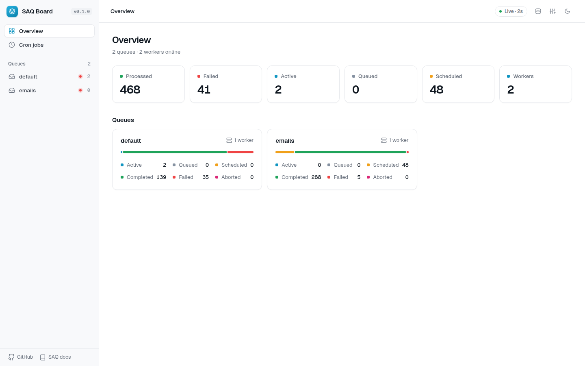
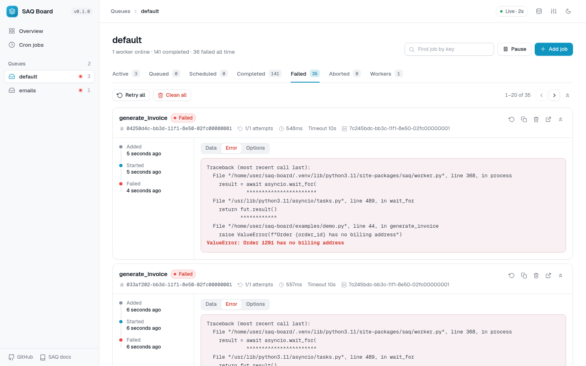
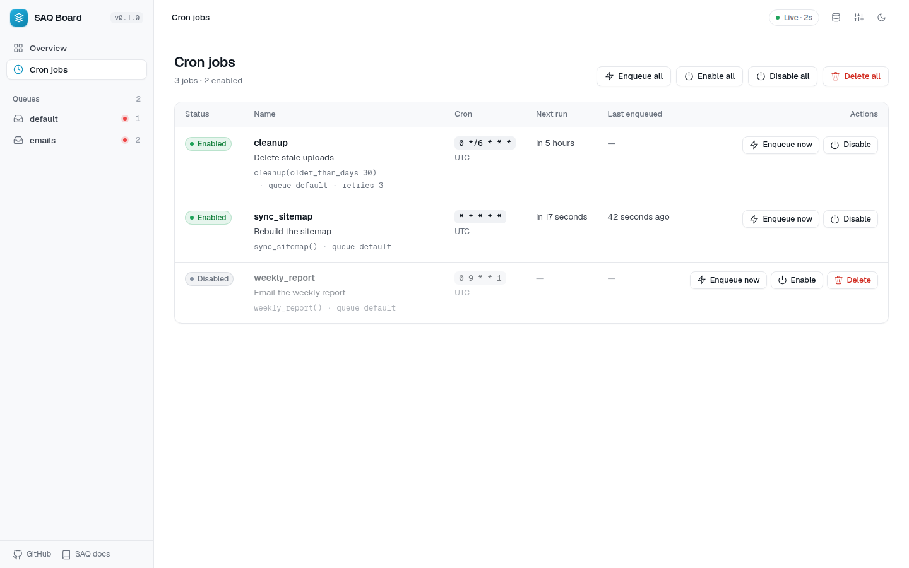

# SAQ Board

A dashboard for [SAQ](https://github.com/tobymao/saq) inspired by [bull-board](https://github.com/felixmosh/bull-board).

It extends SAQ's built-in dashboard and its API is a superset of SAQ's, so it drops in wherever you use `saq.web` today.



| Queue | Cron jobs |
| --- | --- |
|  |  |

## Features

- **Queues**: overview with live counts, per-queue tabs for active, queued, scheduled, completed, failed and aborted jobs, plus workers.
- **Jobs**: bull-board style cards with a timeline, data, result, error and options tabs, progress bars, and retry, abort, run now (promote), duplicate and remove actions.
- **Bulk actions**: retry all, clean all, promote all, abort all.
- **Pause and resume** a queue.
- **Add jobs** from the dashboard, picking from the functions your workers register.
- **Cron jobs**, Sidekiq-cron style: defined in code, then enabled, disabled, enqueued now or deleted from the dashboard, with next run, last enqueued and history.
- Light and dark theme, adjustable refresh, relative or absolute times, local or UTC, read-only mode, Redis stats.
- Preact + htm with no build step, like SAQ's own dashboard. Fonts and scripts ship with the package, so it works offline.

## Install

```sh
pip install "saq-board[starlette]"   # Starlette / FastAPI
pip install "saq-board[web]"         # aiohttp and the saq-board command
```

Redis queues only for now.

## 1. Add the plugin to your workers

SAQ doesn't keep finished jobs, can't pause a queue and schedules cron jobs in code only. The plugin adds all three. Wrap your worker settings:

```python
from saq import Queue
from saq_board import CronJob, with_board

queue = Queue.from_url("redis://localhost")

settings = with_board({
    "queue": queue,
    "functions": [send_email],
    "cron_jobs": [
        CronJob(cleanup, cron="0 * * * *", description="Hourly cleanup"),
    ],
})
```

Run workers exactly as before: `saq app.worker.settings`.

`with_board(settings, history_limit=1000, cron_poll=1.0)`:

- `history_limit`: finished jobs kept per status (complete, failed, aborted). The oldest are dropped first.
- `cron_poll`: seconds between cron checks.

## 2. Run the dashboard

**Starlette / FastAPI**, a drop-in for `saq.web.starlette.saq_web`:

```python
from starlette.routing import Mount
from saq_board import saq_board

routes = [Mount("/monitor", saq_board("/monitor", queues=[queue]))]
# FastAPI: app.mount("/monitor", saq_board("/monitor", queues=[queue]))
```

**aiohttp**, a drop-in for `saq.web.aiohttp.create_app`:

```python
from saq_board import create_app

app.add_subapp("/monitor", create_app([queue], root_path="/monitor"))
```

**On its own**:

```sh
saq-board --url redis://localhost:6379                # queues registered by the plugin
saq-board --url redis://localhost:6379 -q default -q emails
saq-board --settings app.worker.settings --port 8080
```

All of them take `read_only=True` (`--read-only`), which hides every action and rejects them server-side.

### Authentication

Same as SAQ's dashboard. The aiohttp app and the `saq-board` command turn on basic auth when `AUTH_PASSWORD` is set (user `AUTH_USER`, default `admin`); this needs `aiohttp_basicauth`, which the `web` extra installs. With Starlette or FastAPI, protect the mount with your own middleware or dependencies.

## Cron jobs

Cron jobs work like Sidekiq-cron:

- They are defined in code (`cron_jobs` in the worker settings) and synced to Redis when a worker starts.
- The dashboard enables, disables, enqueues now or deletes them. Enabled or disabled survives restarts; a deleted job comes back the next time a worker that defines it starts.
- Every worker process checks the schedule, and a claim in Redis makes sure each run is enqueued once.
- A run that is more than 60 seconds late (for example, no worker was up) is skipped, not caught up.
- `unique=True` (the default, as in SAQ) skips a run while the previous one is still queued or running.
- Times follow the worker's `cron_tz` (UTC by default).

`saq_board.CronJob` is SAQ's `CronJob` plus `name`, `description` and `enabled` (the initial state). Plain `saq.CronJob` works too and is named after its function. Give jobs that share a function different names.

## API

Everything SAQ's dashboard serves, plus:

| Method | Path | |
| --- | --- | --- |
| GET | `/api/queues` | Queues with counts, totals, paused flag and workers |
| GET | `/api/queues/{queue}` | One queue, as in SAQ, plus the registered functions |
| GET | `/api/queues/{queue}/jobs?status=&offset=&limit=` | Jobs by status |
| POST | `/api/queues/{queue}/jobs` | Add a job: `{"function", "kwargs", "options"}` |
| GET | `/api/queues/{queue}/jobs/{job}` | One job |
| POST | `/api/queues/{queue}/jobs/{job}/{action}` | `retry`, `abort`, `promote`, `remove` |
| POST | `/api/queues/{queue}/{action}` | `pause`, `resume`, `promote-all`, and with `{"status"}`: `clean`, `retry-all`, `abort-all` |
| GET | `/api/redis` | Redis stats |
| GET | `/api/cron` | Cron jobs |
| GET | `/api/cron/{queue}/{name}` | One cron job with its history |
| POST | `/api/cron/{queue}/{name}/{action}` | `enqueue`, `enable`, `disable`, `delete` |
| POST | `/api/cron/{action}-all` | The same for every cron job |

## How it works

The plugin wraps the worker's queue: `finish` also records the job in a capped history, and `dequeue` waits while the queue is paused (a pause takes effect within a second). It also moves `cron_jobs` to its own scheduler, so SAQ's scheduler doesn't run them too, and tags the worker's metadata so the dashboard can tell whether workers run the plugin.

Board data lives under each queue's SAQ namespace, `saq:<queue>:board:*`, so it goes away with the queue.

## Development

```sh
python -m venv .venv && .venv/bin/pip install -e ".[dev]" uvicorn
redis-server --daemonize yes
.venv/bin/pytest            # uses redis://localhost:6379/15, override with SAQ_BOARD_TEST_REDIS
.venv/bin/python examples/demo.py   # http://localhost:8000/monitor
```

## Credits

Built by [rkwap](https://github.com/rkwap).

SAQ Board stands on the shoulders of:

- [SAQ](https://github.com/tobymao/saq) by [Toby Mao](https://github.com/tobymao) (MIT): the queue this extends, whose dashboard API, structure and `#1095c1` accent it keeps.
- [bull-board](https://github.com/felixmosh/bull-board) by [felixmosh](https://github.com/felixmosh) (MIT): the dashboard design it follows.
- [Sidekiq-cron](https://github.com/sidekiq-cron/sidekiq-cron) by [ondrejbartas](https://github.com/ondrejbartas) and contributors (MIT): how cron jobs behave and look.
- [Preact](https://preactjs.com) (MIT) and [htm](https://github.com/developit/htm) (Apache-2.0) by Jason Miller, [Feather icons](https://feathericons.com) by Cole Bemis (MIT), and the [Geist](https://vercel.com/font) fonts (SIL OFL 1.1), all bundled. See [THIRD_PARTY_NOTICES.md](THIRD_PARTY_NOTICES.md).

## License

[MIT](LICENSE), like SAQ and bull-board.
